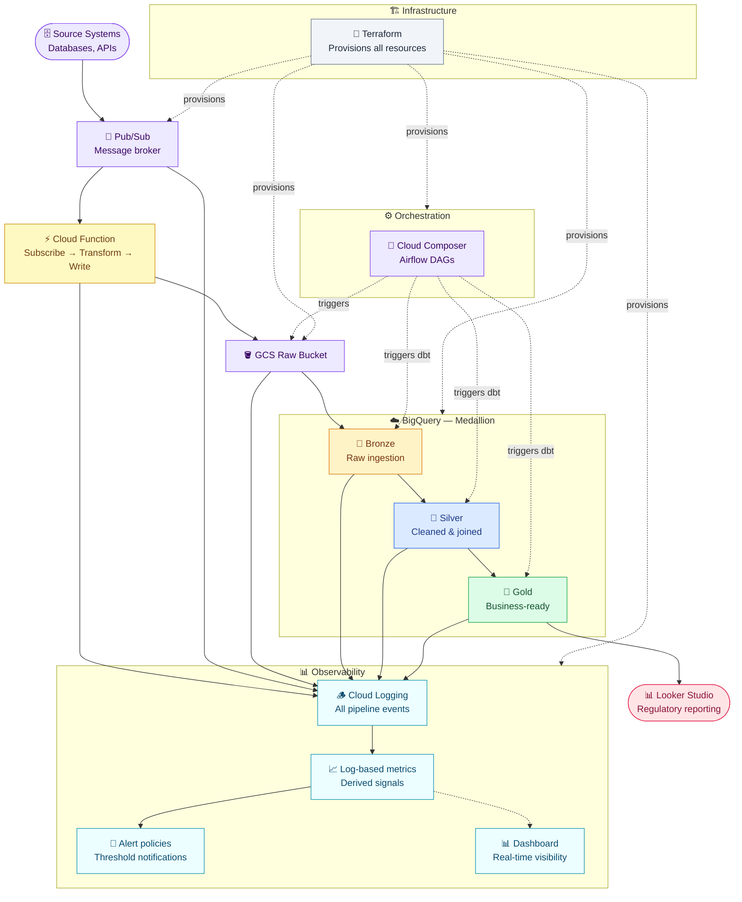
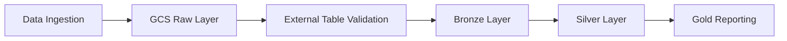

## 🏦 Banking Regulatory Reporting Data Platform | GCP Medallion Architecture

## ⚙️ System Architecture

GCS → Raw data layer

BigQuery → Bronze, Silver, Gold layers

Cloud Composer (Airflow) → Orchestration

Terraform → Infrastructure as Code

## 📊 DATASET

Czech Financial Dataset (Kaggle) https://www.kaggle.com/datasets/mariammariamr/1999-czech-financial-dataset

Banking domain: accounts, transactions, loans, clients

## ✨ KEY FEATURES

Medallion Architecture (Bronze → Silver → Gold)

External Table → Raw Table ingestion pattern

Partitioned BigQuery tables

Data Quality Checks

Regulatory Reporting Layer

## 🔄 PIPELINE

## 🛠️  TECH STACK

Cloud: GCP (BigQuery, GCS, Composer)

Infrastructure: Terraform

Processing: SQL

Orchestration: Airflow

Language: Python
