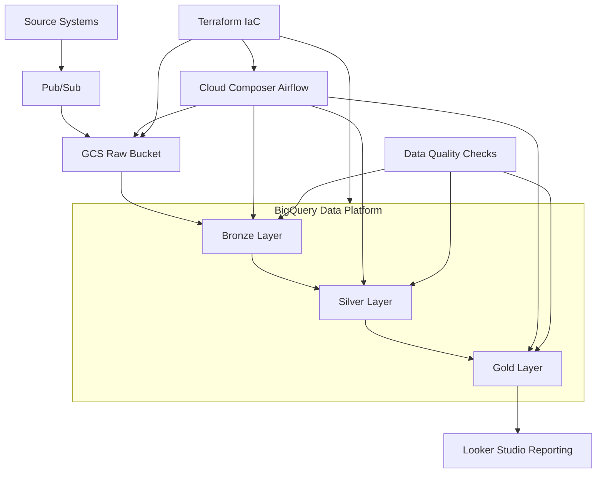

## 🏦 Banking Regulatory Reporting Data Platform (GCP)

## 🏗️ System Architecture

## ⚙️ ARCHITECTURE

GCS → Raw data layer

BigQuery → Bronze, Silver, Gold layers

Cloud Composer (Airflow) → Orchestration

Terraform → Infrastructure as Code

## 📊 DATASET

Czech Financial Dataset (Kaggle)

Banking domain: accounts, transactions, loans, clients

## ✨ KEY FEATURES

Medallion Architecture (Bronze → Silver → Gold)

External Table → Raw Table ingestion pattern

Partitioned BigQuery tables

Data Quality Checks

Regulatory Reporting Layer

## 🔄 PIPELINE FLOW

Data ingestion → GCS

External table validation

Bronze layer load

Silver transformation

Gold reporting

## 🛠️  TECH STACK

Cloud: GCP (BigQuery, GCS, Composer)

Infrastructure: Terraform

Processing: SQL

Orchestration: Airflow

Language: Python
